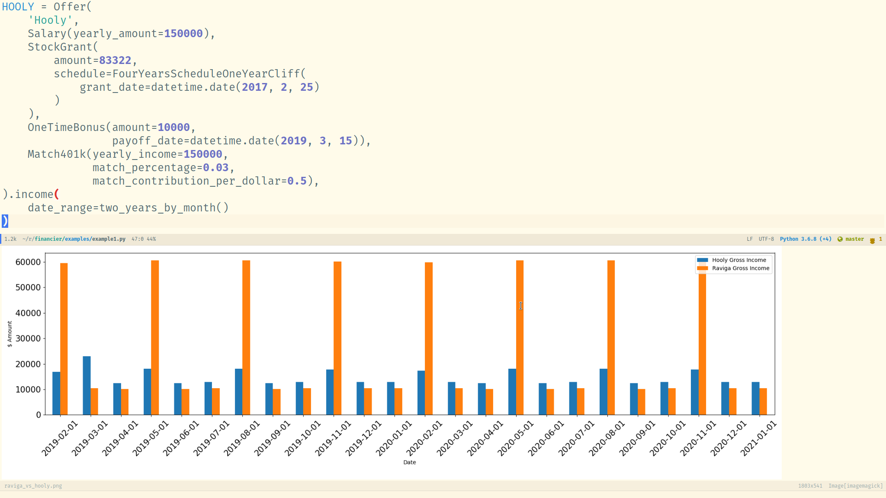

# Financier

Model compensation packages with python. Can be useful to compare job offers.



## Installation

### Installing with pip
TODO

### Manual installation from git

Clone the repo and set up a virtualenv:
```shell
git clone git@github.com:charignon/financier
cd financier
python3 -m venv .
source bin/activate
source bin/activate
pip install -r requirements.txt
```

### Run the example:

```shell
python examples/example1.py
```
## Usage

See blog post: XXX

## Contributing
### Running the tests

```shell
py.test
```
## Origin of the name financier

It is a french adjective that means "related to finance".
